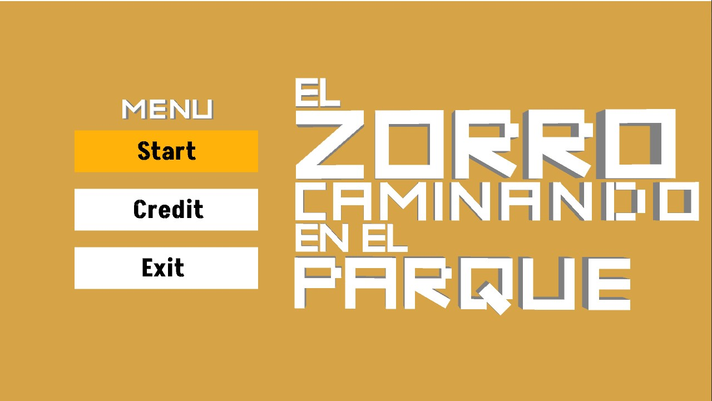
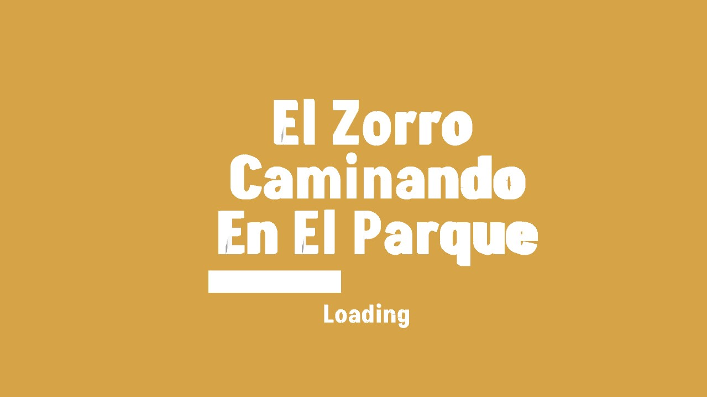
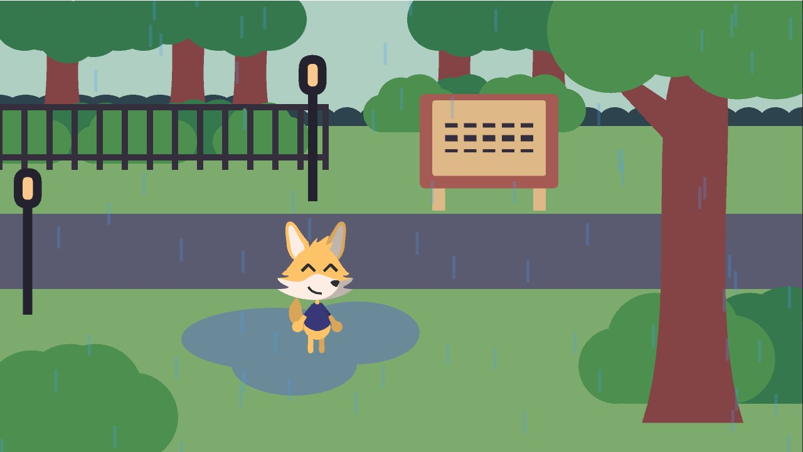
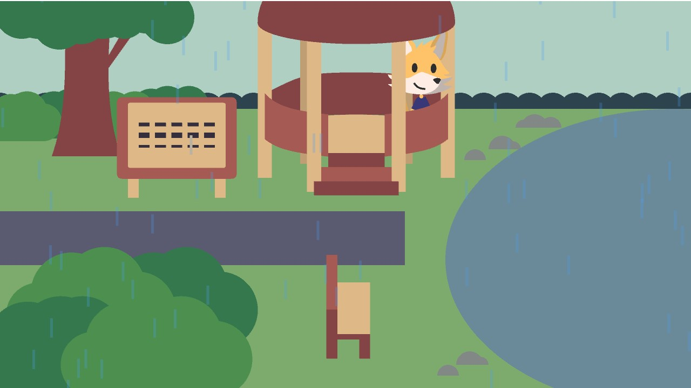
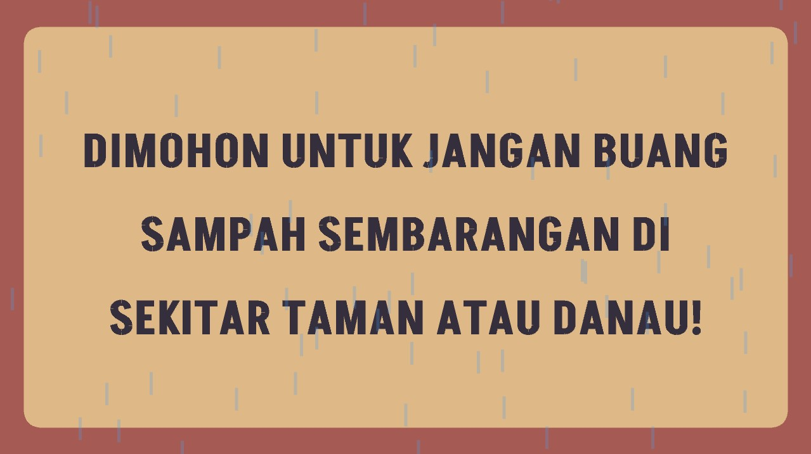

    <h1>FINAL PROJECT KOMPUTER GRAFIK <b><i>El Zorro Caminando En El Parque</i></b></h1> 
    

        
        
<h2>Presented for :</h2>

        
          
        

            

                Informatics 
                Faculty of Engineering 
                Mulawarman University
            

        

    

    

    <h2>Group 4 B1 Members</h2>
        

            Muhammad Nizar 2009106059 (The Leader) 
            Ferry Fathurrahman 2009106051 (1st Member) 
            Muhammad Reyhan Setiawan 2009106052 (2nd Member) 
            Muhammad Basith Algiffari 2009106071 (3rd Member)   
        

    

    

    <h2><i>Title : El Zorro Caminando En El Parque</i></h2>
        

        <i>
            a Sad fox 
            who don't know where 
            and he found a little garden when it rains 
            towards park thinking about what is making him sad and find his own happiness...... 
        </i>
        

    
    

 

## About Final Project

This final project is a simulation game where you as a fox will walk around the park and find several interactions, one of which is a hidden easter egg. the interactions are walking, seeing signs, sitting on park benches, sitting in gazebos etc

## Documentation
### 1. Menu

### 1. Loading

### 3. The Park

### 4. The Lake

### 5. Interacted Sign

    <h1>The End of Readme <b><i>El Zorro Caminando En El Parque</i></b></h1>
    

        
<h2>Thank You!!, Gracias!!, ありがとう!!🙏<h2>
    

